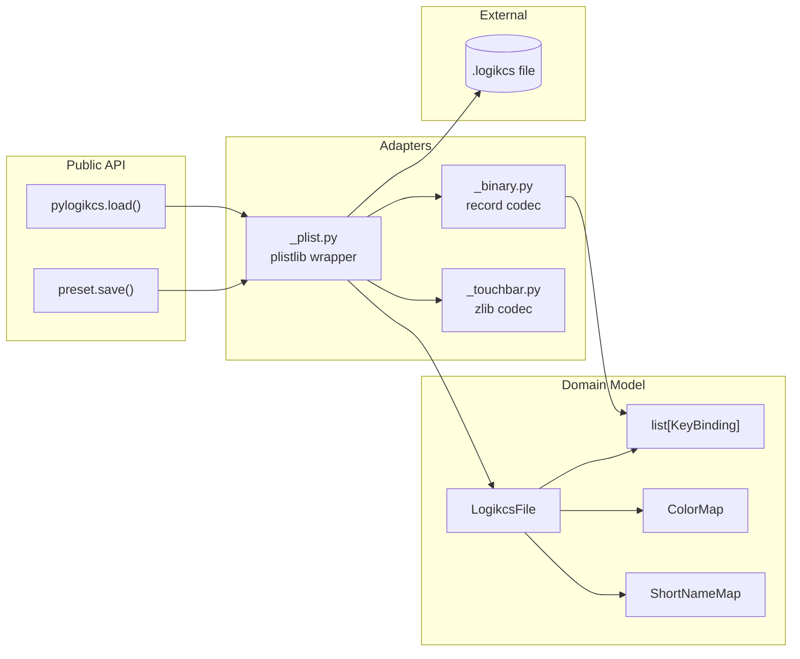
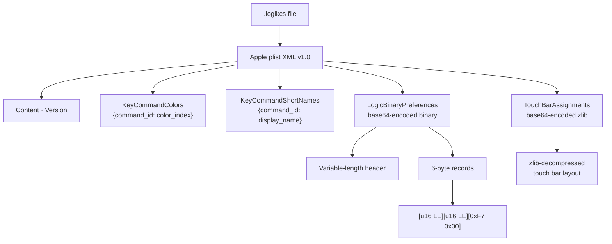
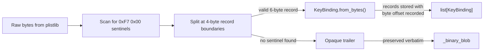
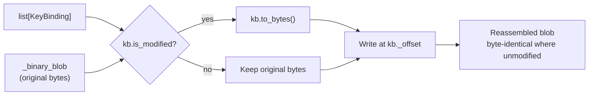
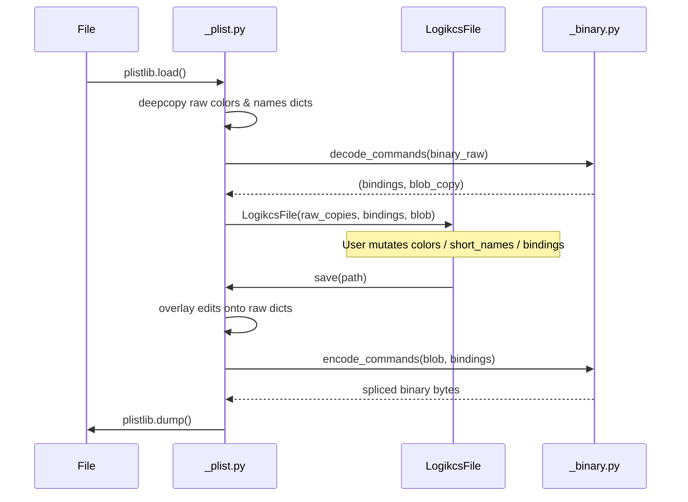

# Architecture: pylogikcs

## System overview

`pylogikcs` is a zero-dependency Python library that reads, edits, and writes
Logic Pro `.logikcs` key-command preset files.  The file format is an Apple
plist XML envelope containing binary key-binding records that require partial
reverse-engineering.



## File format



## Load pipeline

The binary blob is partially reverse-engineered.  Records are identified by
scanning for the sentinel `0xF7 0x00`; the 4 preceding bytes form the record
payload.  Unknown regions (header, gaps, trailer) are preserved verbatim.



### Record structure

Each 6-byte record has this layout (little-endian):

```text
┌──────────┬──────────┬──────────┬──────────┬──────────┬──────────┐
│  byte 0  │  byte 1  │  byte 2  │  byte 3  │   0xF7   │   0x00   │
├──────────┴──────────┼──────────┴──────────┼──────────┴──────────┤
│   command_index     │       value         │     sentinel        │
│      (u16 LE)       │     (u16 LE)        │                      │
└─────────────────────┴─────────────────────┴─────────────────────┘
```

The `value` field encodes the key assignment across two sub-fields:

```text
value (u16 LE) = [key_code: u8 hi] [flags: u8 lo]
```

## Save pipeline

Modified records are spliced back into the original blob at their recorded
offsets.  Unmodified records and all non-record regions pass through unchanged.



## Plist round-trip strategy

The `_plist.py` adapter keeps deep copies of the raw `KeyCommandColors` and
`KeyCommandShortNames` dicts from the original plist.  On write, it overlays
in-memory edits onto those raw copies.  This preserves entries that don't
fit the typed model (e.g., `"New Child" -> ""` in the colours dict).



## Component contracts

| Module | Responsibility | State owned |
| --- | --- | --- |
| `_model.py` | Domain types, validation, no I/O | `LogikcsFile`, `KeyBinding`, `ColorMap`, `ShortNameMap` |
| `_plist.py` | Plist XML I/O, raw-dict overlay | None (pure functions) |
| `_binary.py` | Sentinel scan, record decode/encode, splice | None (pure functions) |
| `_touchbar.py` | Zlib decompress/compress | None (pure functions) |
| `__init__.py` | Public API re-exports | None |
| `_cli.py` | argparse CLI | None |

Dependency direction: `__init__` -> `_model` ← `_plist` -> `_binary`, `_touchbar`.
No circular imports; `_model` imports nothing from the package.

## Key decisions

1. **Opaque blob + typed overlay** — binary sections are kept as raw bytes;
   typed records are parsed from known positions.  On write, modified records
   are spliced in; everything else passes through.  This accepts partial
   format understanding in exchange for guaranteed round-trip fidelity.
2. **Position-based splice** — each `KeyBinding` records its byte offset in
   the original blob.  Encoding writes only modified records at their exact
   positions, leaving gaps and unmodified records byte-identical.
3. **Raw dict copies for plist sections** — the `KeyCommandColors` and
   `KeyCommandShortNames` raw dicts are deep-copied on load.  Edits are
   overlaid on save.  This preserves non-standard entries (e.g., the
   `"New Child"` key with an empty string value) that break typed models.
4. **Zero dependencies** — Python 3.11+ stdlib only.  `plistlib` handles XML;
   `base64` and `zlib` handle binary codecs.

## Tradeoffs

| Decision | Benefit | Cost |
| --- | --- | --- |
| Sentinel-based record parsing | Works without full format spec | Wrong if `0xF7 0x00` appears in payload |
| Position-based splice | Guarantees unmodified bytes survive | Requires storing `_offset` per record |
| Raw dict copies | Non-standard plist entries preserved | Two representations (raw + typed) per section |
| No external deps | Zero install friction | Slower plist writing (stdlib `plistlib` is pure Python) |
