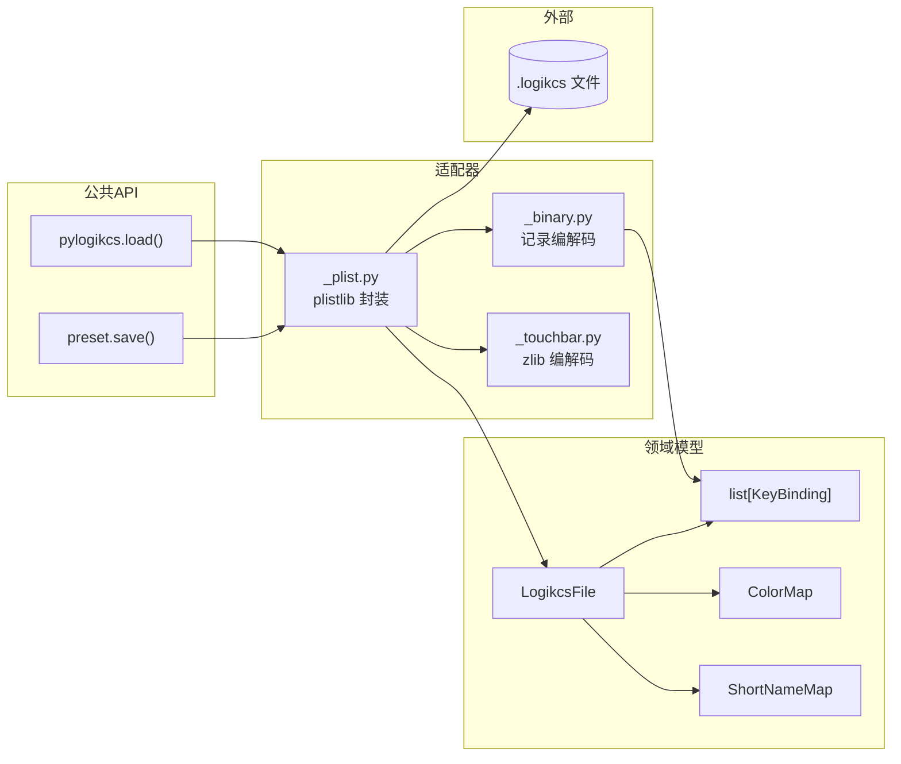
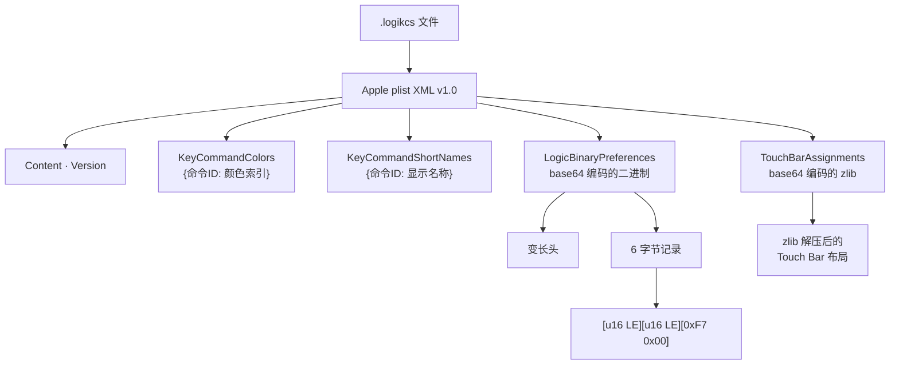
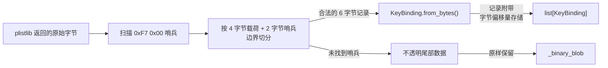
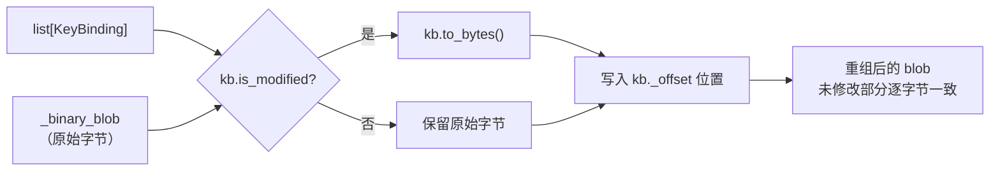
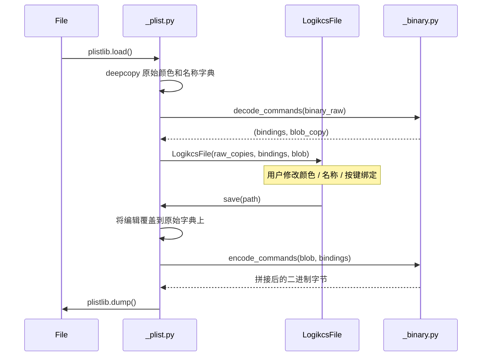

# 架构: pylogikcs

## 系统概览

`pylogikcs` 是一个零依赖的 Python 库，用于读写 Logic Pro `.logikcs` 快捷键预设文件。文
件格式为 Apple plist XML 封装，内含需要部分逆向的二进制按键绑定记录。



## 文件格式



## 加载流程

二进制数据已部分逆向。通过扫描哨兵 `0xF7 0x00` 识别记录；哨兵前 4 字节为记录载荷。未知区域（文件头、间隙、尾部）原样保留。



### 记录结构

每条记录 6 字节（小端序）：

```text
┌──────────┬──────────┬──────────┬──────────┬──────────┬──────────┐
│  byte 0  │  byte 1  │  byte 2  │  byte 3  │   0xF7   │   0x00   │
├──────────┴──────────┼──────────┴──────────┼──────────┴──────────┤
│   command_index     │       value         │     哨兵            │
│      (u16 LE)       │     (u16 LE)        │                      │
└─────────────────────┴─────────────────────┴─────────────────────┘
```

`value` 字段编码按键分配，包含两个子字段：

```text
value (u16 LE) = [key_code: 高 8 位] [flags: 低 8 位]
```

## 保存流程

已修改的记录在原 blob 的对应偏移位置拼接替换。未修改的记录和所有非记录区域原样通过。



## Plist 往返策略

`_plist.py` 适配器在加载时深拷贝原始的 `KeyCommandColors` 和
`KeyCommandShortNames` 字典。写入时，将内存中的编辑覆盖到原始副本上。这保
留了不符合类型模型的条目（如颜色字典中的 `"New Child" -> ""`）。



## 组件契约

| 模块 | 职责 | 持有状态 |
| --- | --- | --- |
| `_model.py` | 领域类型、校验、无 I/O | `LogikcsFile`, `KeyBinding`, `ColorMap`, `ShortNameMap` |
| `_plist.py` | Plist XML I/O、原始字典覆盖 | 无（纯函数） |
| `_binary.py` | 哨兵扫描、记录编解码、拼接 | 无（纯函数） |
| `_touchbar.py` | Zlib 解压/压缩 | 无（纯函数） |
| `__init__.py` | 公共 API 重导出 | 无 |
| `_cli.py` | argparse CLI | 无 |

依赖方向：`__init__` -> `_model` ← `_plist` -> `_binary`, `_touchbar`。
无循环导入；`_model` 不从本包导入任何模块。

## 关键决策

1. **不透明 blob + 类型化覆盖** — 二进制区域保留为原始字节；类型化记录从已知位置
   解析。写入时，已修改记录拼接替换；其余原样通过。以部分格式理解为代价，换取
   确定的往返保真。
2. **基于位置的拼接** — 每条 `KeyBinding` 记录其在原始 blob 中的字节偏移。编码时
   仅将已修改的记录写入其精确位置，间隙和未修改记录保持逐字节一致。
3. **Plist 区域的原始字典副本** — 加载时深拷贝 `KeyCommandColors` 和
   `KeyCommandShortNames` 的原始字典。保存时覆盖编辑。这保留了不符合类型模型的
   条目（如 `"New Child"` 键对应空字符串值）。
4. **零依赖** — 仅使用 Python 3.11+ 标准库。`plistlib` 处理 XML；`base64` 和
   `zlib` 处理二进制编解码。

## 权衡

| 决策 | 收益 | 代价 |
| --- | --- | --- |
| 哨兵扫描解析记录 | 无需完整格式规范 | 若 `0xF7 0x00` 出现在载荷中则出错 |
| 位置拼接 | 保证未修改字节完整保留 | 每条记录需存储 `_offset` |
| 原始字典副本 | 非标准 plist 条目得以保留 | 每区域两份表示（原始 + 类型化） |
| 无外部依赖 | 零安装成本 | plist 写入较慢（stdlib `plistlib` 为纯 Python） |
