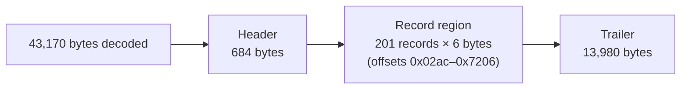
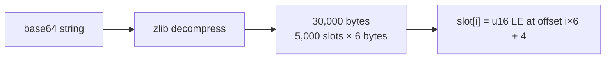

# Logic Pro `.logikcs` File Format

Reverse-engineered from Logic Pro 12.3 `Default.logikcs`.

## Envelope

`.logikcs` is an Apple property list (plist) XML file, version 1.0.

```xml
<?xml version="1.0" encoding="UTF-8"?>
<!DOCTYPE plist PUBLIC "-//Apple//DTD PLIST 1.0//EN"
  "http://www.apple.com/DTDs/PropertyList-1.0.dtd">
<plist version="1.0">
<dict>
    <key>Content</key>
    <string>com.apple.logic.keycommand</string>
    <key>Version</key>
    <string>12.3.0</string>
    <key>KeyCommandColors</key>
    <dict>…</dict>
    <key>KeyCommandShortNames</key>
    <dict>…</dict>
    <key>LogicBinaryPreferences</key>
    <data>…</data>
    <key>TouchBarAssignments</key>
    <data>…</data>
</dict>
</plist>
```

**No other top-level keys** have been observed in the default preset.

## Top-level keys

### `Content` (string)

Always `"com.apple.logic.keycommand"`.  Identifies the file type.

### `Version` (string)

Logic Pro version that authored the preset, e.g. `"12.3.0"`.

### `KeyCommandColors` (dict)

Maps a **user-visible command ID** (string key, decimal) to a colour index
(integer).  Colour indices are in the range 1–7.

One outlier key exists in the default preset: `"New Child"` -> `""` (empty
string).  Its purpose is unknown; it may be a vestigial editor-state entry.

Observed keys in default preset: 62 (including the outlier), values 1–7.

### `KeyCommandShortNames` (dict)

Maps a **user-visible command ID** (string key, decimal) to a short display
name (string).  These are the abbreviated names shown in Logic Pro's Key
Commands window.

Observed keys in default preset: 33.  Examples:

| Command ID | Short name |
| --- | --- |
| `1012` | `Rd/Off` |
| `2000` | `MIDI` |
| `2002` | `Audio` |
| `2004` | `Aux` |

### `LogicBinaryPreferences` (data)

Base64-encoded binary blob.  The core key-binding table.  Described in detail
below.

### `TouchBarAssignments` (data)

Base64-encoded **zlib-compressed** binary blob.  Decompresses to a 30000-byte
sparse lookup table (5102 non-zero entries in default preset).  Internal
structure not yet reverse-engineered.  On macOS, this maps Touch Bar button
positions to Logic functions.

---

## `LogicBinaryPreferences` binary format

### Overview



The binary blob consists of three regions:

1. **Header** (bytes 0x0000–0x02ab, 684 bytes) — keyed metadata.  Contains
   single-character ASCII keys (`L`, `R`, `r`, `C`, `K`, `*`, `c`, `p`, `s`,
   etc.) followed by short integer or string values.  Likely encodes section
   lengths, version tags, or internal lookup tables.

2. **Record region** (bytes 0x02ac–0x7205, 1206 bytes) — 201 six-byte key-binding
   records, each terminated by the sentinel `0xF7 0x00`.

3. **Trailer** (bytes 0x7206–end, 13,980 bytes) — mostly zeroes with 247 sparse
   non-zero bytes.  Purpose unknown; may be a fixed-size buffer for future
   key-binding slots.

### Record structure

Every record is exactly 6 bytes:

```text
┌──────────┬──────────┬──────────┬──────────┬──────────┬──────────┐
│  byte 0  │  byte 1  │  byte 2  │  byte 3  │   0xF7   │   0x00   │
├──────────┴──────────┼──────────┴──────────┼──────────┴──────────┤
│     payload A       │     payload B       │     sentinel        │
│     (u16 LE)        │     (u16 LE)        │                      │
└─────────────────────┴─────────────────────┴─────────────────────┘
```

The 4-byte payload encodes two 16-bit little-endian words.  The semantic
mapping depends on the record **subtype**.

#### Record subtype A — key binding

The most common subtype.  `payload A` is the **key assignment**; `payload B`
is the **internal command index**.

```text
payload A (u16 LE) = [key_code: u8 hi] [flags: u8 lo]
payload B (u16 LE) = internal_command_index (big-endian semantics unconfirmed)
```

- `key_code` — Apple virtual key code (Carbon `kVK_*` constants).  Observed
  values in default preset:

  | Value | Carbon constant | Key |
  | --- | --- | --- |
  | `0x00` | `kVK_ANSI_A` | A |
  | `0x01` | `kVK_ANSI_S` | S |
  | `0x02` | `kVK_ANSI_D` | D |
  | `0x03` | `kVK_ANSI_F` | F |
  | `0x28` | — | ( |
  | `0x29` | — | ) |
  | `0x2b` | `kVK_ANSI_Comma`? | + |
  | `0x2c` | — | , |
  | `0x2d` | — | - |

  A subset of these map to standard Carbon virtual key codes; others
  (0x28–0x2d) match ASCII code points directly, suggesting Logic uses a
  hybrid mapping.

- `flags` — modifier key bitmask.  All 201 records in the default preset have
  `flags = 0x00` (no modifiers).  Modifier constants are unconfirmed but
  likely match Carbon event flags (e.g. `cmdKey=0x08`, `shiftKey=0x02`,
  `optionKey=0x04`, `controlKey=0x01`).

- `internal_command_index` — an integer identifying the Logic function.  These
  are **not** the user-visible command IDs found in `KeyCommandColors` or
  `KeyCommandShortNames`.  The mapping between internal indices and
  user-visible IDs is not yet known.

#### Record subtype B — internal lookup

A minority of records have payload values that produce implausible command
indices (>10000) when interpreted as subtype A.  These are likely internal
lookup tables or metadata records, not user-editable key bindings.  Examples
from the default preset:

| Raw payload | LE word A | LE word B | Notes |
| --- | --- | --- | --- |
| `1c 20 00 02` | 8220 | 512 | Grouped in runs of 3–4; byte 0 increments |
| `1d 20 00 03` | 8221 | 768 | |
| `1e 20 00 00` | 8222 | 0 | |

These appear in clusters of 3–14 records at various offsets.  The first byte
increments monotonically within each cluster (`0x1c`->`0x1d`->`0x1e`->`0x1f`),
suggesting indexed entries.

### Record statistics (default preset, 201 records)

| Property | Count |
| --- | --- |
| Total records | 201 |
| Unique `payload A` values | 59 |
| Unique `payload B` values | 59 |
| Unique key_code values | 9 |
| Unique flags values | 1 (`0x00`) |
| Records with `key_code` in 0x00–0x03 | 168 (83%) |
| Records with `key_code` in 0x28–0x2d | 33 (16%) |

### Record ordering

Records are not sorted by command index or key code.  Records with the same
command index are grouped consecutively.  The order appears to follow Logic's
internal command registration order.

### Header section (bytes 0x0000–0x02ab)

The 684-byte header contains keyed metadata with single-character ASCII keys.
Non-zero data appears in bands:

```hex
0x01c6:  4c 00 00 00 00 01     "L" + 5-byte value
0x01cc:  2c 00 00 00 00 01     "," + 5-byte value
0x01d2:  52 00 00 00 00 01     "R" + 5-byte value
0x01e0:  72 00 00 72 00 00     "r\0\0r\0\0"
0x01e6:  43 00 00 00 00 01     "C" + 5-byte value
0x01ec:  2e 20 00 2e 00 00     ". .\0.\0\0"
...
0x020c:  63 00 00 63 00 00     "c\0\0c\0\0"
0x0212:  70 2c 00 70 00 00     "p,\0p\0\0"
0x0218:  73 04 00 73 00 00     "s\x04\0s\0\0"
0x022a:  4b 00 00 00 00 01     "K" + 5-byte value
0x0230:  2a 00 00 00 00 01     "*" + 5-byte value
```

The header likely encodes:

- Section or table lengths (`L`, `R`, `C`, `K`)
- Internal data pointers or counts
- A second copy of some record data (`r`, `c`, `p`, `s` entries mirror some
  key-binding records)

### Trailer (bytes 0x7206–end)

13,980 bytes, mostly zeroes.  247 non-zero bytes scattered throughout.  The
trailer may be a fixed-size allocation for potential future key-binding
assignments, or it may encode data in a section that happens to be mostly
empty in the default preset.

---

## `TouchBarAssignments` format

- Compressed: zlib (RFC 1950), 294 bytes -> 30,000 bytes decompressed
- Structure: sparse array of 16-bit entries (little-endian)
- Each entry is at a fixed 6-byte stride (30,000 / 5,000 = 6 bytes per slot)
- Observed entries are mostly `0x0002` with occasional `0x0005` and similar values
- Likely encodes: `[Touch Bar slot index] -> [internal function ID]`



Each 6-byte slot: 4 bytes of zero padding + 2 bytes (u16 LE) function index.

---

## User-visible command IDs vs internal indices

Two separate ID spaces exist:

| Space | Where used | Example |
| --- | --- | --- |
| User-visible command ID | `KeyCommandColors`, `KeyCommandShortNames` | `1012` -> `"Rd/Off"` |
| Internal command index | `LogicBinaryPreferences` record payload | `11`, `12`, `28`, `2059`, `2076` |

The mapping between these spaces is not yet reverse-engineered.  The header
section may encode this mapping.

## Header section — keyed entries

The 684-byte header contains two copies of a key-binding table at mirrored
offsets (copy 1: ~0x01c8–0x0260, copy 2: ~0x3384–0x3420).  Each entry is
4 bytes:

```text
┌──────────┬──────────┬──────────┬──────────┐
│  byte 0  │  byte 1  │  byte 2  │  byte 3  │
├──────────┼──────────┼──────────┼──────────┤
│ key_code │  flags   │   0x00   │ key_code │
│ (ASCII)  │          │(reserved)│  (dupe)  │
└──────────┴──────────┴──────────┴──────────┘
```

- **key_code** — the unmodified character the key produces (ASCII).  Uppercase
  letters are stored as lowercase (e.g., `'P'` → `0x70` `'p'`).
  The encoding is hybrid:

  | Range | Encoding | Examples |
  | --- | --- | --- |
  | `0x20`–`0x7e` | ASCII printable | Space (`0x20`), `'a'` (`0x61`), `'-'` (`0x2d`) |
  | `0x00`–`0x1f`, `0x7f` | Apple Carbon `kVK_*` | Return (`0x24`), Delete (`0x33`), Escape (`0x35`), Tab (`0x30`) |
  | `0x7b`–`0x7e` | Carbon arrow keys | Left (`0x7b`), Right (`0x7c`), Down (`0x7d`), Up (`0x7e`) |
  | `0x80`–`0xff` | Extended ASCII (locale-specific) | Swedish `'ä'` (`0xe4`), `'å'` (`0xe5`), `'ö'` (`0xf6`) |

  Non-English presets (Swedish, Simplified Chinese) use high-byte codes for
  locale-specific characters.  The Swedish preset confirmed this with 505
  keyboard bindings matching the `Swedish_clipboard.txt` export.

- **flags** — modifier key bitmask:

  | Value | Modifier | Source |
  | --- | --- | --- |
  | `0x00` | None | Default preset, all records |
  | `0x01` | Shift (⇧) | `Record_R_to_SHIFT_R.logikcs` |
  | `0x04` | Ctrl (⌃) | `Play_SPACE_to_CTRL_SPACE.logikcs` |
  | `0x08` | Opt (⌥) | `Play_SPACE_to_OPT_SPACE.logikcs` |
  | `0x20` | Cmd (⌘) | `Play_SPACE_to_CMD_P.logikcs` |

  Multi-modifier combinations confirmed via bitwise OR across 9 locale presets:

  | Flags | Combination | Example command |
  | --- | --- | --- |
  | `0x21` | Cmd+Shift | "Save Project as…" |
  | `0x25` | Cmd+Ctrl+Shift | "Unpack Take Folder…" |
  | `0x28` | Cmd+Opt | "Split Regions/Events…" |
  | `0x09` | Opt+Shift | "Open Tempo List…" |
  | `0x0d` | Opt+Ctrl+Shift | "Toggle Autopunch Mode" (German) |
  | `0x2c` | Cmd+Opt+Ctrl | "Toggle Autopunch Mode" (French) |

- **byte 2** — always `0x00` in observed entries.  Reserved or padding.

- **byte 3** — duplicate of byte 0.  Likely a checksum or alignment aid.

A second entry format appears in the header:

```text
┌──────────┬──────────┬──────────┬──────────┬──────────┬──────────┐
│  byte 0  │  byte 1  │  byte 2  │  byte 3  │  byte 4  │  byte 5  │
├──────────┼──────────┼──────────┼──────────┼──────────┼──────────┤
│ key_code │   0x00   │   0x00   │   0x00   │   0x00   │   0x01   │
│ (ASCII)  │          │          │          │          │(sentinel)│
└──────────┴──────────┴──────────┴──────────┴──────────┴──────────┘
```

This 6-byte variant omits the flags byte and the duplicate.  It may represent
commands in a "disabled" or "unassigned" state, or encode a different key type
(single-keystroke commands vs. key-binding assignments).  The trailing `0x01`
byte acts as a type tag.

Both formats coexist in the header.  Format B entries are converted to
Format A when a modifier is assigned.

## Unknowns

1. Mapping from **every** internal command index to user-visible command ID
   (287 IDs named via plist registry; ~573 remain unlabeled)
2. Record subtype B internal structure (the ~20 records with inflated indices)
3. Semantics of the 6-byte header entry format (Format B — disabled/unassigned)
4. Trailer purpose (12–22 KB depending on LP version)
5. Touch Bar slot-to-function mapping (user's device has no Touch Bar)
6. The `"New Child"` → `""` entry in KeyCommandColors

## Cross-version compatibility

| Version | Format | `f7 00` records | Colors/Names | TouchBar | Binary size | Library support |
| --- | --- | --- | --- | --- | --- | --- |
| Logic Pro 7.x–9.1.1 | Pre-LPX | None — 6-byte records at offset 0x01c8, no sentinels | No | No | 45–51 KB | ✅ Parsed (raw .pro or .logikcs) |
| Logic Pro 10.0–10.6.2 | Early LPX | Yes — 135–242 records | Yes (61/33) | Yes (zlib) | 51,508 | ✅ Full parse |
| Logic Pro 10.7–12.3.0 | Current LPX | Yes — 155–256 records | Yes (61–62/33–42) | Yes (zlib) | 43,170 | ✅ Full parse |

The `f7 00` sentinel record format was introduced in Logic Pro X (10.0) and
is stable through 12.3.  LP 10.7 reduced the trailer allocation.

Logic Pro 7–9 use contiguous 6-byte records (`[key_code][flags][u32 zeros]`)
starting at offset 0x01c8.  Files from this era may be either `.pro` (raw
binary) or `.logikcs` (plist XML wrapper).  The library autodetects the
format and parses both correctly.  Format A header entries appear in
pre-LPX files but without mirrored copies.

`KeyCommandColors`, `KeyCommandShortNames`, and `TouchBarAssignments` plist
keys were added in Logic Pro X.  Pre-LPX files have only `Content`,
`Version`, and `LogicBinaryPreferences` (plist-wrapped) or are raw binary
(`.pro`).
